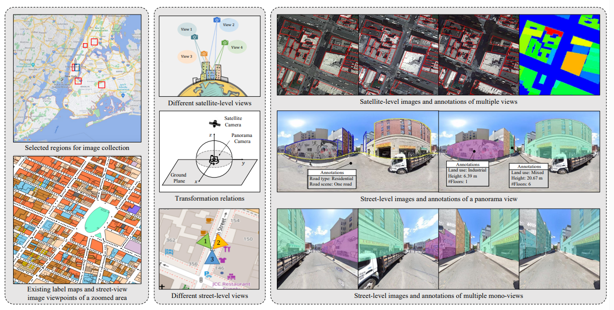
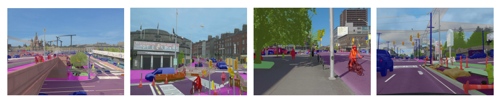
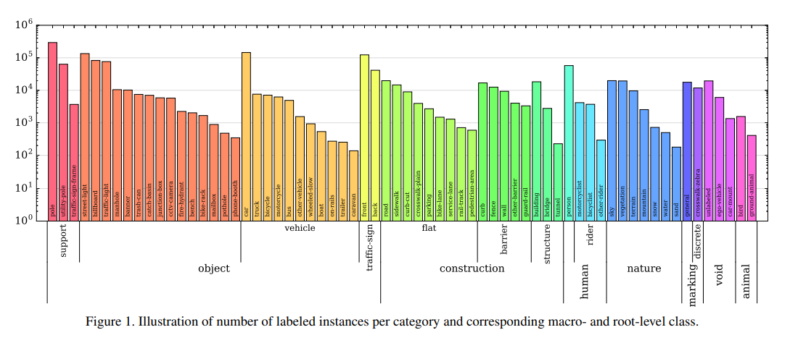

# Dataset Brainstorm/Overview
Author: Alyssa Wu
## OmniCity: Omnipotent City Understanding with Multi-level and Multi-view Images

Link to Paper: https://openaccess.thecvf.com/content/CVPR2023/papers/Li_OmniCity_Omnipotent_City_Understanding_With_Multi-Level_and_Multi-View_Images_CVPR_2023_paper.pdf 

Github Link: https://github.com/sysu-liweijia-lab/OmniCity-v1.0
(**includes both the OmniCity dataset + models used in paper for instance and land use building segmentation**)

* 100K+ images collected from 25K geo-locations in New York City
* has ariel, streetview panaroma, and streetview monoview images 
* images are annotated with building instance (whether a building exists) & land use (family building, mixed residential/commercial, office, etc.)

## The Mapillary Vistas Dataset for Semantic Understanding of Street Scenes

Link to Paper: https://openaccess.thecvf.com/content_ICCV_2017/papers/Neuhold_The_Mapillary_Vistas_ICCV_2017_paper.pdf 

Link to Dataset: https://www.mapillary.com/dataset/vistas (need to log in to download)

* largescale street-level image dataset containing 25K highresolution images annotated into 66 object categories with
additional, instance-specific labels for 37 classes

** would need to isolate buildling class label **